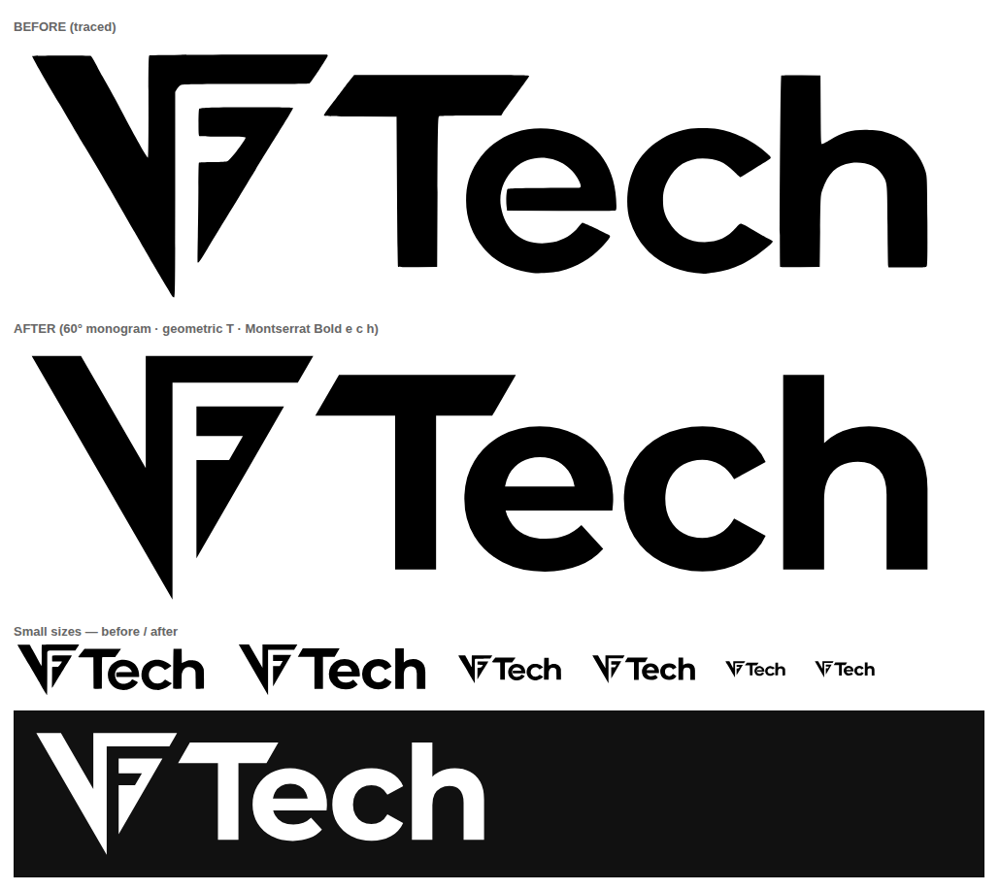
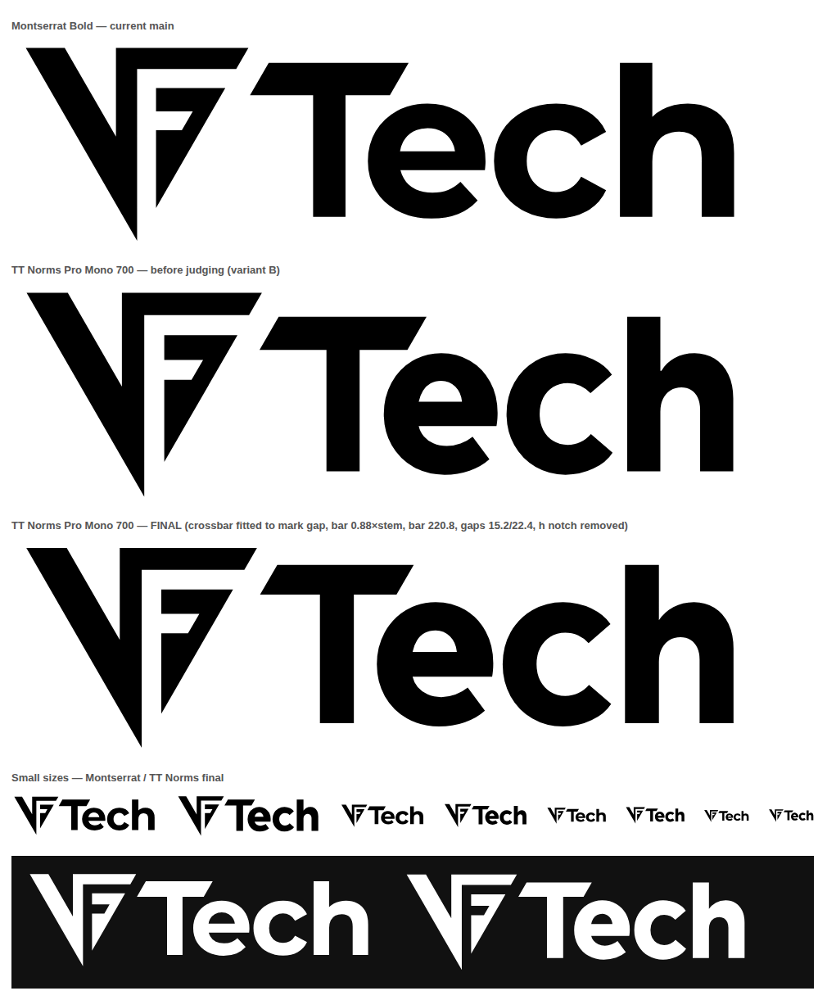

# VFTech logo



| File | Use |
|---|---|
| `vftech-logo.svg` | Horizontal lockup (monogram + wordmark), transparent |
| `vftech-monogram.svg` | Monogram master, 1000-unit grid, no transforms |
| `vftech-icon.svg` | Square 1254 px icon, white background, optically centred |
| `vftech-logo-ttnorms.svg` | **Evaluation only.** Same lockup with TT Norms Pro Mono lowercase (see below) |
| `build.py` | Regenerates all of these from the construction below |

## Construction

**Monogram** is built on an equilateral triangle with a side of 1000 units. Every angle is 30°, 60°, 90° or 120°.

- Stem and top bar are 95 units. The V arm is 175 units measured horizontally, which is 151.6 measured perpendicular.
- All internal gaps are 85 units, and the F arms are 105 and 85 units.
- The diagonal of the F lies exactly on the right edge of the triangle.

**T** is a custom glyph.

- Stem and crossbar are both 54.3 units, the same as the Montserrat Bold stem.
- The crossbar is a parallelogram with 60° ends, parallel to the monogram's cut.
- The top of the crossbar aligns with the ascender of the h.

**e c h** are set in Montserrat Bold (700), SIL OFL 1.1, at tracking −24 (−0.024 em), and converted to outlines.

**Lockup**

- The monogram is scaled to 0.3732 relative to the wordmark grid.
- The 60° gap between the mark's top bar and the T crossbar is 42 units wide.
- The bottom point of the mark sits 40 units below the baseline.

**Icon**: the mark is shifted 41 px below the true centre of its bounding box. The triangle is top-heavy (its ink centroid is at 34% of its height), so a box-centred mark looks too high.

## TT Norms Pro option (evaluation only)



`vftech-logo-ttnorms.svg` is built from the **trial** of TT Norms Pro Mono. That font's license allows evaluation only, not commercial or personal use. Before this version can be used anywhere, buy a TypeType license that covers logo use and rebuild from the licensed file. Licensing proportional TT Norms Pro rather than the Mono version would also give the font's real spacing.

```
python3 build.py TT_Norms_Pro_Mono.woff --suffix=-ttnorms --fit-bar-to-mark --bar-ratio 0.88 --bar-len 220.8 --gaps 15.2,22.4
```

Changes from the Montserrat construction, all from a four-judge review:

- **Scale**: TT Norms' ascender is short relative to its x-height. The wordmark is therefore scaled (to 0.3657) so the T crossbar is centred on the gap between the mark's top bar and its F bar, as in the Montserrat lockup.
- **Weight**: weight 700 (the trial's maximum). The stem is 54.9, and the crossbar is 48.3 (0.88 × stem), matching TT Norms' horizontal strokes.
- **T crossbar**: 220.8 long, which keeps Montserrat's ratio of crossbar to e width. The minimum T-to-e distance is 29.3 (Montserrat 28.7).
- **Spacing**: the font is monospaced, so its own spacing can't be used. The fixed gaps are e→c 15.2 and c→h 22.4. The c→h gap is relatively tighter than Montserrat's because TT Norms' c is more open.
- **h**: the font's 5-unit notch where the shoulder meets the stem is removed, since it shows at display sizes.

## Known limitations

- The 30° points (V tip, F tip, V crotch) and the 85-unit gaps fill in below about 24 px. A simplified favicon cut with wider gaps would fix this.
- Keep the full lockup at least about 100 px wide (about 32 px tall) at 1×. Below that, the e→c gap and the e's opening close up; use `vftech-icon.svg` instead.
